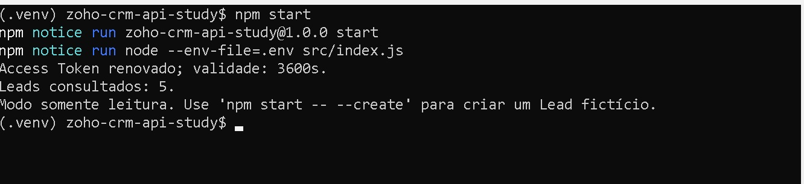
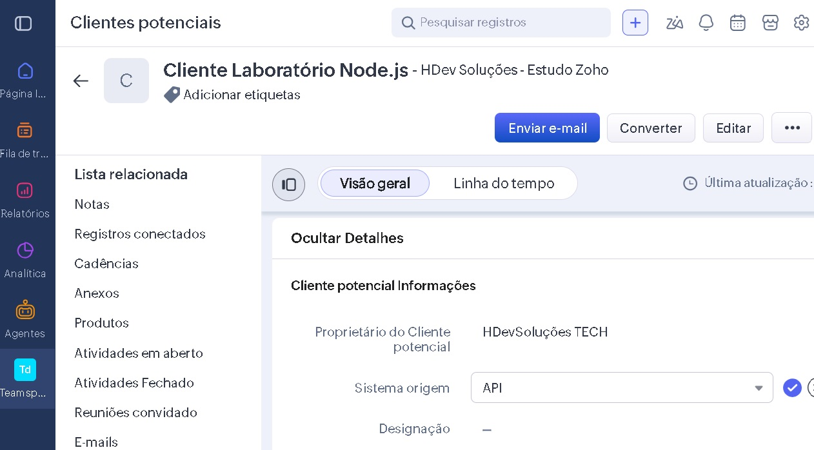
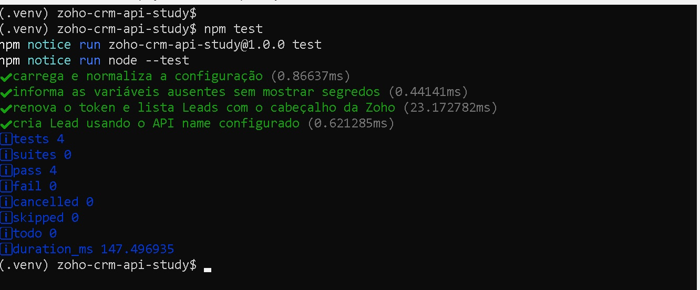

# Laboratório Node.js — Zoho CRM API V8

Projeto de estudo para validar o fluxo OAuth 2.0 da Zoho CRM sem armazenar o
Access Token. A aplicação usa o Refresh Token para obter um token temporário,
consulta Leads e, somente mediante uma opção explícita, cria um Lead fictício.

## Pré-requisitos

- Node.js 20.6 ou superior;
- Self Client no Zoho API Console;
- Refresh Token com os scopes:

```text
ZohoCRM.modules.leads.READ
ZohoCRM.modules.leads.CREATE
ZohoCRM.modules.leads.UPDATE
ZohoCRM.settings.fields.READ
```

## Configuração

Copie o modelo de variáveis:

```bash
cp .env.example .env
```

Preencha o `.env` local com suas credenciais. O arquivo está no `.gitignore` e
nunca deve ser enviado ao GitHub, Drive, mensagens ou documentação pública.

```env
ZOHO_CLIENT_ID=seu_client_id
ZOHO_CLIENT_SECRET=seu_client_secret
ZOHO_REFRESH_TOKEN=seu_refresh_token
ZOHO_ACCOUNTS_URL=https://accounts.zoho.com
ZOHO_API_DOMAIN=https://www.zohoapis.com
ZOHO_CUSTOM_SOURCE_FIELD=Lista_de_op_es
```

Use os domínios efetivamente associados à sua conta. A resposta da renovação
do token pode atualizar automaticamente o domínio usado pelas chamadas.

## Execução segura

O comando padrão apenas renova o token e lista até cinco Leads:

```bash
npm start
```

### Consulta de Leads

A execução renova o Access Token em memória e consulta os Leads sem exibir
credenciais ou informações sensíveis no terminal.



Para criar um Lead fictício, é necessário declarar a intenção:

```bash
npm start -- --create
```

### Resultado no Zoho CRM

O Lead fictício criado pela aplicação pode ser consultado diretamente no CRM.
O campo personalizado **Sistema origem** foi preenchido com o valor **API**.



O projeto nunca imprime tokens ou segredos. Ele exibe somente a validade do
token, a quantidade consultada e, em caso de criação, o ID do registro.

## Testes

Os testes usam respostas simuladas e não acessam sua conta Zoho:

```bash
npm test
```

Resultado esperado:



Os quatro testes validam o carregamento da configuração, a proteção dos
segredos, a renovação do token, a consulta de Leads e a criação utilizando
o API name configurado.

## Fluxo implementado

1. Lê as credenciais de `.env`.
2. Faz `POST /oauth/v2/token` com o Refresh Token.
3. Mantém o Access Token somente em memória.
4. Envia `Authorization: Zoho-oauthtoken ...` para a API V8.
5. Lista Leads com campos explícitos.
6. Cria um Lead apenas com `--create`.

## Próximas evoluções

- atualizar o Lead criado;
- adicionar validação de entrada;
- criar uma API Express;
- integrar com n8n;
- adicionar logs estruturados sem credenciais;
- preparar demonstração e documentação para portfólio.
